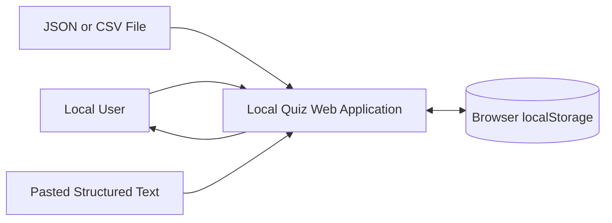
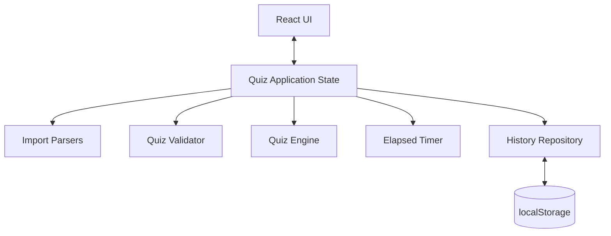

# Local Quiz Application — Software Architecture

**Document version:** 1.0  
**Date:** 2026-07-22  
**Status:** Baseline architecture — ready for implementation  
**Project type:** Personal open-source local web application  
**Prepared for:** Initial implementation using a coding agent  

---

## 1. Executive Summary

The Local Quiz Application is a browser-based quiz tool that allows users to load quiz content from a JSON file, CSV file, or pasted structured text. It runs locally through a React development server and does not require a backend, user account, remote database, or internet connection after dependencies have been installed.

The application supports multiple-choice and true/false questions. Questions and answer choices are randomized for each attempt. Questions are displayed one at a time. After an answer is submitted, the answer is locked and immediate feedback, the correct answer, and the definition or explanation are shown.

At the end of an attempt, the application displays the score and elapsed time. It stores the latest 100 attempt summaries in browser `localStorage`. Users can retry a quiz, load another quiz, review prior results, and clear result history manually.

The implementation stack is:

- React
- TypeScript
- Vite
- Node.js
- npm
- Browser `localStorage`
- No backend
- No external runtime dependency in the built browser application

---

## 2. Goals and Success Criteria

### 2.1 Goals

1. Allow a user to load a quiz from JSON, CSV, or pasted structured content.
2. Validate the entire quiz before allowing it to start.
3. Support multiple-choice and true/false questions.
4. Present one question at a time.
5. Randomize question order and answer order for every attempt.
6. Show immediate feedback after each submitted answer.
7. Save summary results locally.
8. Work on desktop, tablet, and mobile browsers.
9. Work without a backend or hosted service.
10. Keep the project easy to clone, understand, and extend from GitHub.

### 2.2 Success Criteria

The baseline release is successful when:

- A user can run the project with `npm install` and `npm start`.
- Valid JSON and CSV quiz files containing up to 100 questions load successfully.
- Pasted structured content can be parsed using the same supported JSON or CSV format.
- Invalid quiz data is rejected before the quiz begins.
- All validation errors are shown together.
- Questions and choices are randomized without corrupting the correct-answer mapping.
- Every submitted answer becomes locked.
- The app immediately shows correctness, the correct answer, and the definition.
- Users can navigate backward to review previously answered questions.
- Users cannot finish until every question is answered.
- The final score is calculated correctly.
- Elapsed time starts when the quiz begins and stops when it is finished.
- The latest 100 attempt summaries persist after browser refresh.
- The user can clear saved history after confirming the action.
- The interface remains usable at common mobile and desktop viewport sizes.

---

## 3. Scope

### 3.1 In Scope

- Local React web application
- TypeScript source code
- Vite development and production build
- JSON file upload
- CSV file upload
- Structured text paste
- Multiple-choice questions
- True/false questions
- One question per screen
- Question randomization
- Answer randomization
- Immediate answer feedback
- Answer locking
- Definition or explanation display
- Previous and next navigation
- Required answer submission
- Final score
- Retry
- Elapsed-time display
- Local result history
- Maximum of 100 stored attempts
- Manual result-history clearing
- JSON and CSV templates
- Copy buttons for supported structures
- Responsive layout
- English interface
- Language selector showing English as the only currently available language
- GitHub-ready source repository
- Unit and component tests

### 3.2 Out of Scope for Version 1

- Backend API
- User authentication
- Cloud synchronization
- Hosted database
- Multiplayer quizzes
- Teacher or administrator accounts
- Quiz authoring form
- Visual import preview
- Import editing
- Countdown timer
- Timed expiration
- Partial scoring
- Multiple correct answers
- Typed-answer questions
- Images, audio, or video in questions
- Remote quiz URLs
- GitHub Pages deployment
- Exporting attempt history
- Sharing results
- Analytics dashboard
- Accessibility certification
- Multiple interface languages
- Encryption of local history
- Cross-device synchronization

### 3.3 Future Possibilities

- Additional interface languages
- Quiz authoring UI
- Countdown timer
- Multiple correct answers
- Short-answer questions
- Import preview and correction
- Attempt export
- Progressive Web App support
- Offline installable application
- GitHub Pages or static hosting
- Question categories
- Difficulty levels
- Per-question timing
- Bookmarks
- Remote quiz libraries
- Optional backend and user accounts

---

## 4. Stakeholders and User Roles

### 4.1 Primary User

A person who downloads or clones the repository, starts the application locally, supplies quiz content, completes quizzes, and reviews results.

### 4.2 Repository Maintainer

The person responsible for:

- Source-code maintenance
- Dependency updates
- Documentation
- Test coverage
- Issue triage
- Release packaging

### 4.3 User Roles

Version 1 has one application role:

| Role | Capabilities |
|---|---|
| Local user | Import quiz data, start quizzes, answer questions, review feedback, retry quizzes, view and clear local history |

There is no authentication or authorization layer.

---

## 5. Functional Requirements

| ID | Requirement | Priority |
|---|---|---|
| FR-001 | The application shall accept a JSON quiz file. | Must |
| FR-002 | The application shall accept a CSV quiz file. | Must |
| FR-003 | The application shall accept pasted structured quiz text. | Must |
| FR-004 | The application shall provide copyable JSON and CSV format examples. | Must |
| FR-005 | The application shall provide downloadable JSON and CSV templates. | Must |
| FR-006 | The application shall validate the entire imported quiz before starting. | Must |
| FR-007 | The application shall reject the entire quiz when any validation error exists. | Must |
| FR-008 | The application shall display all discovered validation errors together. | Must |
| FR-009 | The application shall support multiple-choice questions. | Must |
| FR-010 | The application shall support true/false questions. | Must |
| FR-011 | A multiple-choice question shall contain at least two answers. | Must |
| FR-012 | A true/false question shall contain exactly two answers. | Must |
| FR-013 | The correct answer shall be identified by a one-based answer position in imported data. | Must |
| FR-014 | The application shall support quizzes containing 1 to 100 questions. | Must |
| FR-015 | The application shall randomize question order for each attempt. | Must |
| FR-016 | The application shall randomize answer order for each attempt. | Must |
| FR-017 | The application shall preserve the correct answer after answer randomization. | Must |
| FR-018 | The application shall display one question at a time. | Must |
| FR-019 | The user shall select an answer before submitting the current question. | Must |
| FR-020 | The application shall lock an answer after submission. | Must |
| FR-021 | The application shall immediately show whether the submitted answer was correct. | Must |
| FR-022 | The application shall immediately show the correct answer after submission. | Must |
| FR-023 | The application shall immediately show the definition or explanation after submission. | Must |
| FR-024 | The user shall be able to navigate to previously answered questions. | Must |
| FR-025 | The user shall not be able to modify a locked answer. | Must |
| FR-026 | The user shall not be able to finish until all questions are answered. | Must |
| FR-027 | The application shall display elapsed time during an active quiz. | Must |
| FR-028 | The timer shall start when the user starts the quiz. | Must |
| FR-029 | The timer shall stop when the quiz is finished. | Must |
| FR-030 | The application shall calculate and display the final score. | Must |
| FR-031 | The application shall allow the user to retry the current quiz. | Must |
| FR-032 | A retry shall create a new randomized attempt. | Must |
| FR-033 | The application shall store the attempt date, quiz name, and score. | Must |
| FR-034 | The application shall retain only the latest 100 result records. | Must |
| FR-035 | The application shall allow the user to clear all result history. | Must |
| FR-036 | The application shall request confirmation before clearing history. | Must |
| FR-037 | The application shall provide an English language selector option. | Must |
| FR-038 | The language architecture shall allow more languages to be added later. | Should |
| FR-039 | The application shall allow the user to load a different quiz after finishing or leaving the current one. | Must |
| FR-040 | The application shall warn before discarding an active unfinished attempt when appropriate. | Should |

---

## 6. Non-Functional Requirements

| ID | Requirement | Priority |
|---|---|---|
| NFR-001 | The application shall run without a backend. | Must |
| NFR-002 | Quiz content shall remain in the browser and shall not be transmitted externally. | Must |
| NFR-003 | The application shall support current desktop, tablet, and mobile browsers. | Must |
| NFR-004 | The layout shall remain usable from approximately 320 px viewport width upward. | Must |
| NFR-005 | The application shall process a 100-question quiz without noticeable interface freezing on a typical consumer device. | Must |
| NFR-006 | Import validation should complete within one second for a normal 100-question quiz on a typical device. | Should |
| NFR-007 | The application shall preserve result history across browser refreshes. | Must |
| NFR-008 | The application shall not crash when malformed input is supplied. | Must |
| NFR-009 | Error messages shall identify the affected row or question and field where possible. | Must |
| NFR-010 | Core logic shall be separated from React presentation components. | Must |
| NFR-011 | Parser, validator, randomization, scoring, timer, and history logic shall be testable independently. | Must |
| NFR-012 | The codebase shall use TypeScript strict mode. | Must |
| NFR-013 | No remote content-delivery network shall be required at runtime. | Must |
| NFR-014 | The production build shall be static browser assets. | Must |
| NFR-015 | The application shall use semantic HTML and keyboard-accessible controls. | Should |
| NFR-016 | Text and controls shall have clear focus states. | Should |
| NFR-017 | Destructive history clearing shall require explicit confirmation. | Must |
| NFR-018 | Imported files shall have a configurable size limit to reduce browser memory abuse. | Should |
| NFR-019 | The code shall follow linting and formatting rules. | Should |
| NFR-020 | The repository shall contain setup, data-format, and usage documentation. | Must |

---

## 7. Constraints

| ID | Constraint |
|---|---|
| CON-001 | Runtime and package management shall use Node.js and npm. |
| CON-002 | The frontend shall use React. |
| CON-003 | The codebase shall use TypeScript. |
| CON-004 | The build tool shall use Vite. |
| CON-005 | Version 1 shall not use a backend. |
| CON-006 | Version 1 shall not require internet access during application use. |
| CON-007 | Session history shall use browser `localStorage`. |
| CON-008 | Version 1 shall support no more than 100 questions per quiz. |
| CON-009 | The interface language shall be English only in version 1. |
| CON-010 | GitHub Pages deployment is excluded from version 1. |

---

## 8. Assumptions and Dependencies

### 8.1 Assumptions

| ID | Assumption | Impact if False | Validation |
|---|---|---|---|
| ASM-001 | Users can install Node.js and npm. | Local development cannot start. | Confirm in README prerequisites. |
| ASM-002 | Users operate a modern browser with File API and `localStorage`. | File import or history may fail. | Browser compatibility testing. |
| ASM-003 | Quiz data contains plain text only. | Data model must expand for media or rich text. | Keep version 1 schema explicit. |
| ASM-004 | One correct answer exists per question. | Scoring and schema must change. | Enforce in validator. |
| ASM-005 | A definition is required for every question. | Validator rules would need relaxation. | Enforce and document. |
| ASM-006 | Result records do not contain sensitive personal information. | Local data controls may be insufficient. | Store only date, name, and score. |
| ASM-007 | Users accept that clearing browser data removes saved history. | Persistence expectations may not be met. | Explain in UI and README. |
| ASM-008 | CSV answer values will not use the selected answer delimiter unescaped. | CSV parsing could produce incorrect answers. | Prefer repeated answer columns or JSON-array text as described below. |

### 8.2 External Dependencies

Recommended runtime dependencies:

- `react`
- `react-dom`
- `papaparse`

Recommended development dependencies:

- `typescript`
- `vite`
- `@vitejs/plugin-react`
- `vitest`
- `jsdom`
- `@testing-library/react`
- `@testing-library/jest-dom`
- `@testing-library/user-event`
- `eslint`
- TypeScript-aware ESLint packages
- `prettier`

Dependency versions should be selected and locked when implementation begins.

---

## 9. Key User Workflows

### 9.1 Load and Start Quiz

1. User opens the application.
2. The home screen shows:
   - File upload
   - Paste input
   - Format examples
   - Download template buttons
   - Copy structure buttons
   - Language selector
   - History link or panel
3. User uploads a JSON/CSV file or pastes structured data.
4. The input type is detected from:
   - File extension for uploads
   - Explicit format selector or content detection for pasted text
5. The parser converts raw data into a common raw quiz model.
6. The validator evaluates the complete quiz.
7. If errors exist:
   - The entire quiz is rejected.
   - All errors are displayed.
   - The user remains on the import screen.
8. If valid:
   - The normalized quiz is held in memory.
   - A quiz-ready summary is shown, such as quiz name and question count.
9. User clicks **Start Quiz**.
10. The application creates a randomized attempt and starts the timer.

### 9.2 Answer Question

1. One question is displayed.
2. User selects one answer.
3. User clicks **Submit Answer**.
4. The application records the selected internal answer ID.
5. The answer becomes locked.
6. The application shows:
   - Correct or incorrect status
   - Correct answer
   - Definition
7. User moves to the next question or reviews a prior answered question.

### 9.3 Finish Quiz

1. All questions have locked answers.
2. The **Finish Quiz** action becomes available.
3. User finishes the quiz.
4. Timer stops.
5. Score is calculated.
6. Attempt summary is stored.
7. Results screen displays:
   - Quiz name
   - Correct count
   - Total questions
   - Percentage
   - Elapsed time
   - Retry action
   - Load another quiz action
   - Answer review

### 9.4 Retry Quiz

1. User selects **Retry**.
2. The same normalized source quiz is reused.
3. Questions are reshuffled.
4. Answer choices are reshuffled.
5. A new attempt starts with no prior selections.
6. A new result record is created when completed.

### 9.5 Clear History

1. User opens history.
2. User selects **Clear history**.
3. Confirmation dialog appears.
4. If confirmed, saved result records are removed.
5. If cancelled, no data changes.

---

## 10. Proposed System Architecture

### 10.1 Architecture Style

A single-page client-side React application using a layered modular architecture:

- Presentation layer
- Application/state layer
- Domain layer
- Infrastructure/adapters layer

No server-side components are required.

### 10.2 Context Diagram



### 10.3 Container Diagram



### 10.4 Major Components

| Component | Responsibility |
|---|---|
| Import Screen | Accept file uploads and pasted content |
| Template Panel | Show, copy, and download JSON/CSV structures |
| JSON Parser | Parse JSON into the raw quiz model |
| CSV Parser | Parse CSV into the raw quiz model |
| Quiz Validator | Return all schema and business-rule errors |
| Quiz Normalizer | Convert validated raw data into stable internal IDs |
| Quiz Randomizer | Shuffle questions and answers while preserving correctness |
| Attempt Engine | Manage progress, selected answers, locking, scoring, and navigation |
| Timer Service/Hook | Track elapsed time |
| Quiz Screen | Render one question and immediate feedback |
| Results Screen | Display score, time, retry, and review |
| History Repository | Read, append, trim, and clear attempt summaries |
| History Screen/Panel | Display and clear saved results |
| Localization Service | Resolve UI strings by language key |
| Error Boundary | Prevent unexpected UI crashes from blanking the application |

---

## 11. Frontend Module Design

Recommended source structure:

```text
src/
├── app/
│   ├── App.tsx
│   ├── AppRouter.tsx
│   └── ErrorBoundary.tsx
├── components/
│   ├── Button/
│   ├── ConfirmDialog/
│   ├── ErrorList/
│   ├── FileDropzone/
│   ├── LanguageSelector/
│   ├── ProgressBar/
│   └── TimerDisplay/
├── features/
│   ├── import/
│   │   ├── ImportPage.tsx
│   │   ├── PasteInput.tsx
│   │   ├── TemplatePanel.tsx
│   │   └── import.types.ts
│   ├── quiz/
│   │   ├── QuizPage.tsx
│   │   ├── QuestionCard.tsx
│   │   ├── AnswerList.tsx
│   │   ├── FeedbackPanel.tsx
│   │   ├── QuizNavigation.tsx
│   │   └── quiz.reducer.ts
│   ├── results/
│   │   ├── ResultsPage.tsx
│   │   └── AnswerReview.tsx
│   └── history/
│       ├── HistoryPage.tsx
│       └── HistoryList.tsx
├── domain/
│   ├── quiz.types.ts
│   ├── quiz.schema.ts
│   ├── quiz.validator.ts
│   ├── quiz.normalizer.ts
│   ├── quiz.randomizer.ts
│   ├── quiz.scoring.ts
│   └── attempt.types.ts
├── infrastructure/
│   ├── parsers/
│   │   ├── jsonQuizParser.ts
│   │   ├── csvQuizParser.ts
│   │   └── parser.types.ts
│   ├── storage/
│   │   └── localHistoryRepository.ts
│   └── download/
│       └── templateDownload.ts
├── hooks/
│   ├── useElapsedTimer.ts
│   └── useBeforeUnloadWarning.ts
├── i18n/
│   ├── en.ts
│   └── index.ts
├── utils/
│   ├── shuffle.ts
│   ├── date.ts
│   ├── download.ts
│   └── guards.ts
├── styles/
│   ├── globals.css
│   └── tokens.css
├── test/
│   └── setup.ts
├── main.tsx
└── vite-env.d.ts

public/
└── templates/
    ├── quiz-template.json
    └── quiz-template.csv
```

---

## 12. Data Model

### 12.1 Raw Imported Quiz

```ts
export type RawQuestionType = "multiple-choice" | "true-false";

export interface RawQuiz {
  quizName: string;
  questions: RawQuestion[];
}

export interface RawQuestion {
  type: RawQuestionType;
  question: string;
  answers: string[];
  correctAnswer: number; // one-based imported position
  definition: string;
}
```

### 12.2 Normalized Internal Quiz

The imported position must not remain the source of truth after shuffling.

```ts
export type QuestionType = "multiple-choice" | "true-false";

export interface Quiz {
  id: string;
  name: string;
  questions: Question[];
}

export interface Question {
  id: string;
  type: QuestionType;
  prompt: string;
  answers: Answer[];
  correctAnswerId: string;
  definition: string;
}

export interface Answer {
  id: string;
  text: string;
}
```

### 12.3 Attempt Model

```ts
export type AttemptStatus = "not-started" | "active" | "completed";

export interface QuizAttempt {
  id: string;
  quizId: string;
  quizName: string;
  status: AttemptStatus;
  startedAt: string;
  completedAt?: string;
  elapsedSeconds: number;
  questionOrder: string[];
  questions: AttemptQuestion[];
  currentQuestionIndex: number;
}

export interface AttemptQuestion {
  questionId: string;
  answerOrder: string[];
  selectedAnswerId?: string;
  isLocked: boolean;
  isCorrect?: boolean;
}
```

### 12.4 Stored Result Summary

```ts
export interface QuizResultSummary {
  id: string;
  quizName: string;
  completedAt: string;
  correctAnswers: number;
  totalQuestions: number;
  scorePercent: number;
}
```

Only this summary is persisted in version 1. Full answers and elapsed time are not required in saved history.

---

## 13. Import Formats

## 13.1 JSON Format

```json
{
  "quizName": "Sample Quiz",
  "questions": [
    {
      "type": "multiple-choice",
      "question": "What is the capital of France?",
      "answers": ["London", "Paris", "Berlin", "Madrid"],
      "correctAnswer": 2,
      "definition": "Paris is the capital of France."
    },
    {
      "type": "true-false",
      "question": "The Earth is flat.",
      "answers": ["True", "False"],
      "correctAnswer": 2,
      "definition": "Earth is approximately spherical."
    }
  ]
}
```

### JSON Rules

- Root must be an object.
- `quizName` must be a non-empty string.
- `questions` must be an array containing 1 to 100 items.
- Every question must include all required fields.
- `correctAnswer` is one-based.
- Unknown fields may be ignored.
- Duplicate answer text is rejected.

## 13.2 CSV Format

Recommended format:

```csv
quizName,type,question,answers,correctAnswer,definition
Sample Quiz,multiple-choice,What is the capital of France?,"[""London"",""Paris"",""Berlin"",""Madrid""]",2,Paris is the capital of France.
Sample Quiz,true-false,The Earth is flat.,"[""True"",""False""]",2,Earth is approximately spherical.
```

The `answers` column contains a JSON array encoded as a CSV field.

### Reason for This CSV Design

Using a JSON array in the `answers` column is safer than a custom separator such as `|` because answer text may legitimately contain separator characters. The CSV parser handles the outer CSV quoting, and `JSON.parse` handles the answers array.

### CSV Rules

- Required headers:
  - `quizName`
  - `type`
  - `question`
  - `answers`
  - `correctAnswer`
  - `definition`
- All rows must use the same non-empty `quizName`.
- Blank trailing rows may be ignored.
- Each `answers` cell must parse as a JSON array of strings.
- `correctAnswer` must parse as an integer.
- Row numbers should be included in validation errors.

## 13.3 Pasted Content

The import screen should provide a format selector:

- JSON
- CSV

Automatic detection may be added later, but explicit selection reduces ambiguity and produces clearer errors.

---

## 14. Validation Design

### 14.1 Validation Result

```ts
export interface ValidationError {
  code: string;
  message: string;
  questionIndex?: number;
  rowNumber?: number;
  field?: string;
}

export interface ValidationResult<T> {
  valid: boolean;
  value?: T;
  errors: ValidationError[];
}
```

### 14.2 Validation Rules

#### Quiz-Level

- Quiz object exists.
- Quiz name is a string.
- Quiz name is not empty after trimming.
- Questions is an array.
- At least one question exists.
- No more than 100 questions exist.
- CSV rows use the same quiz name.

#### Question-Level

- Type is `multiple-choice` or `true-false`.
- Question text is a non-empty string.
- Answers is an array.
- Every answer is a non-empty string after trimming.
- Answers contain no duplicate text after trimming and case-normalization.
- Multiple-choice has at least two answers.
- True/false has exactly two answers.
- Correct answer is an integer.
- Correct answer is at least 1.
- Correct answer does not exceed the answer count.
- Definition is a non-empty string.

### 14.3 Error Behavior

- Parsing errors and validation errors are accumulated when possible.
- The entire quiz is rejected if any error exists.
- The UI displays an error summary followed by individual errors.
- Errors should use plain language.

Example:

```text
Quiz could not be loaded. Fix the following 3 errors:

1. Row 4 — correctAnswer must be between 1 and 3.
2. Row 7 — definition is required.
3. Row 9 — duplicate answer "Paris".
```

---

## 15. Randomization Design

### 15.1 Required Order of Operations

1. Parse imported data.
2. Validate imported positions.
3. Normalize every answer into an internal answer ID.
4. Convert `correctAnswer` position into `correctAnswerId`.
5. Create a new attempt.
6. Shuffle question IDs.
7. Shuffle answer IDs independently for every question.
8. Store the shuffled order in the attempt.

### 15.2 Shuffle Function

Use Fisher-Yates shuffle.

```ts
export function shuffle<T>(items: readonly T[], random = Math.random): T[] {
  const result = [...items];

  for (let index = result.length - 1; index > 0; index -= 1) {
    const swapIndex = Math.floor(random() * (index + 1));
    [result[index], result[swapIndex]] = [
      result[swapIndex],
      result[index],
    ];
  }

  return result;
}
```

Injecting the random function allows deterministic unit tests.

---

## 16. State Management

Version 1 does not require Redux or another external state library.

Use:

- React component state for small UI state
- `useReducer` for the active attempt
- React Context only when state must be shared across routes or major page boundaries

### 16.1 Suggested Top-Level State

```ts
export interface AppState {
  loadedQuiz?: Quiz;
  activeAttempt?: QuizAttempt;
  lastCompletedAttempt?: QuizAttempt;
  importErrors: ValidationError[];
}
```

### 16.2 Attempt Actions

```ts
type AttemptAction =
  | { type: "START_ATTEMPT"; payload: QuizAttempt }
  | { type: "SELECT_ANSWER"; questionId: string; answerId: string }
  | { type: "SUBMIT_ANSWER"; questionId: string }
  | { type: "GO_TO_QUESTION"; index: number }
  | { type: "NEXT_QUESTION" }
  | { type: "PREVIOUS_QUESTION" }
  | { type: "UPDATE_ELAPSED_TIME"; elapsedSeconds: number }
  | { type: "COMPLETE_ATTEMPT"; completedAt: string }
  | { type: "RESET_ATTEMPT" };
```

Reducer invariants:

- A locked question cannot change selection.
- An unanswered question cannot be submitted.
- An attempt cannot complete while any question is unlocked.
- Current index must stay within bounds.
- Completed attempts cannot accept mutations.

---

## 17. Timer Design

Use a custom `useElapsedTimer` hook.

### Behavior

- Start timestamp is recorded when the attempt starts.
- Display value updates once per second.
- Elapsed time is derived from timestamps, not only from incrementing state.
- The timer stops when the attempt completes.
- Browser tab throttling must not significantly distort final elapsed time.
- Formatting:
  - Under one hour: `MM:SS`
  - One hour or more: `HH:MM:SS`

Conceptual implementation:

```ts
elapsedSeconds = Math.floor((Date.now() - startedAtMs) / 1000);
```

---

## 18. History Storage

### 18.1 Storage Key

```text
local-quiz-app.results.v1
```

### 18.2 Repository Interface

```ts
export interface HistoryRepository {
  getAll(): QuizResultSummary[];
  add(result: QuizResultSummary): QuizResultSummary[];
  clear(): void;
}
```

### 18.3 Storage Rules

- Store JSON.
- Newest results appear first.
- Keep at most 100 records.
- Adding record 101 removes the oldest record.
- Invalid or corrupt stored JSON should not crash the app.
- When corruption is detected:
  - Return an empty history.
  - Optionally replace the invalid stored value.
  - Log a development warning without exposing technical details to users.

### 18.4 Persistence Limitations

The UI or README should state:

- History is stored only in the current browser.
- Clearing site data removes history.
- History does not synchronize across devices or browsers.

---

## 19. Navigation and Routing

Either of the following is acceptable:

### Preferred for Version 1

Use a small internal page-state enum without React Router:

```ts
type AppView = "import" | "quiz" | "results" | "history";
```

Advantages:

- Fewer dependencies
- No static hosting route configuration
- Simple state transitions

React Router may be introduced later if URL-based navigation becomes useful.

---

## 20. UI Specification

### 20.1 Import Screen

Must include:

- Application title
- Short description
- Language selector
- File upload control
- Accepted format note
- Pasted text area
- Format selector for pasted text
- Load quiz button
- JSON template:
  - Copy button
  - Download button
- CSV template:
  - Copy button
  - Download button
- Validation error area
- Result history access

### 20.2 Quiz Screen

Must include:

- Quiz name
- Progress, such as `Question 3 of 20`
- Progress bar
- Elapsed time
- Question text
- Answer options
- Submit answer button
- Immediate feedback panel
- Definition
- Previous button
- Next button
- Finish button when eligible
- Exit or load-another-quiz action with warning

### 20.3 Results Screen

Must include:

- Quiz name
- Final score
- Correct and total counts
- Percentage
- Elapsed time
- Answer review
- Retry button
- Load another quiz button
- View history button

### 20.4 History Screen

Must include:

- Date
- Quiz name
- Score
- Newest-first ordering
- Empty-history message
- Clear-history button
- Confirmation dialog
- Back action

---

## 21. Responsive and Accessibility Design

### 21.1 Responsive Rules

- Mobile-first CSS
- Main content centered with a maximum readable width
- Touch targets approximately 44 px high where practical
- Answer cards use full available width
- Navigation buttons wrap on small screens
- Long questions and definitions wrap without horizontal scrolling
- Error lists remain readable on narrow screens
- No layout dependency on hover

### 21.2 Accessibility Baseline

- Use semantic headings.
- Associate labels with input controls.
- Use radio buttons for answer selection.
- Use `fieldset` and `legend` for answer groups when appropriate.
- Place feedback in an `aria-live` region.
- Maintain visible keyboard focus.
- Do not communicate correct/incorrect state by color alone.
- Disable controls using semantic `disabled`.
- Give confirmation dialogs proper labels and focus behavior.
- Keep timer announcements non-disruptive; do not announce every second.

---

## 22. Localization Design

Use key-based translations even though English is the only version 1 language.

```ts
export const en = {
  appTitle: "Local Quiz",
  importQuiz: "Import quiz",
  startQuiz: "Start quiz",
  submitAnswer: "Submit answer",
  nextQuestion: "Next question",
  previousQuestion: "Previous question",
  finishQuiz: "Finish quiz",
  retryQuiz: "Retry quiz",
  clearHistory: "Clear history",
} as const;
```

The language selector should:

- Display `English`
- Be disabled or show only one option
- Avoid promising unavailable languages
- Use a structure that can accept additional locale objects later

---

## 23. Security and Privacy

### 23.1 Security Model

This is a low-risk local application, but untrusted uploaded content must still be treated defensively.

Controls:

- Render imported text using normal React text interpolation.
- Do not use `dangerouslySetInnerHTML`.
- Do not evaluate uploaded content.
- Do not execute scripts from imported files.
- Do not dynamically import user-provided paths.
- Enforce a maximum file size.
- Limit quiz count to 100 questions.
- Limit text lengths to reasonable values.
- Avoid logging full imported quiz content in production.
- Do not transmit quiz data or history.

### 23.2 Suggested Input Limits

These are provisional and may be adjusted:

| Field | Suggested Limit |
|---|---:|
| File size | 2 MB |
| Quiz name | 150 characters |
| Question text | 2,000 characters |
| Answer text | 1,000 characters |
| Definition | 5,000 characters |
| Answers per question | 50 |
| Questions per quiz | 100 |

### 23.3 Privacy

Stored result data contains only:

- Quiz name
- Completion date
- Correct count
- Total count
- Percentage

No names, email addresses, or identifiers are collected.

---

## 24. Reliability and Failure Handling

| Failure | Detection | User Behavior | Recovery |
|---|---|---|---|
| Invalid JSON syntax | JSON parser exception | Show parse error | User corrects input |
| Invalid CSV syntax | CSV parser errors | Show all parser errors | User corrects file |
| Missing required fields | Validator | Reject quiz | User fixes data |
| Invalid correct-answer index | Validator | Reject quiz | User fixes index |
| Duplicate answers | Validator | Reject quiz | User changes answers |
| File too large | File-size check | Reject before reading | User supplies smaller file |
| Corrupt history JSON | Storage adapter | Show empty history | Reset stored history |
| Browser storage unavailable | Storage exception | Quiz still works; history warning | Continue without persistence |
| Unexpected React render error | Error boundary | Show recovery screen | Return to import page |
| Refresh during active quiz | Not preserved in version 1 | Attempt is lost | User restarts quiz |
| User exits active attempt | Navigation warning | Confirm discard | Remain or discard |

---

## 25. Testing Strategy

### 25.1 Unit Tests

#### Parsers

- Valid JSON
- Invalid JSON
- Valid CSV
- Invalid CSV
- CSV answers JSON-array parsing
- Blank rows
- Numeric correct-answer conversion

#### Validator

- Empty quiz name
- Missing questions
- Zero questions
- More than 100 questions
- Unsupported type
- Empty question text
- Fewer than two answers
- Incorrect true/false answer count
- Empty answer
- Duplicate answer
- Non-integer correct answer
- Out-of-range correct answer
- Empty definition
- Multiple errors returned together

#### Normalizer

- IDs assigned
- One-based position converted correctly
- Correct answer ID preserved

#### Randomizer

- Does not mutate source arrays
- Preserves all items
- Preserves correct-answer ID
- Supports deterministic injected random function

#### Scoring

- All correct
- None correct
- Mixed result
- Percentage rounding rule

#### History Repository

- Empty storage
- Add result
- Newest-first order
- Maximum 100 records
- Oldest removal
- Clear
- Corrupt storage recovery
- Storage exceptions

#### Timer Utilities

- Format seconds
- Format minutes
- Format hours
- Timestamp-derived elapsed duration

### 25.2 Component Tests

- Import screen accepts file
- Pasted JSON loads
- Pasted CSV loads
- Error list displays all errors
- Copy template works
- Download button creates a file
- Answer cannot submit without selection
- Submitted answer locks
- Correct feedback appears
- Definition appears
- Previous navigation works
- Locked answer cannot change
- Finish unavailable before completion
- Results display correct score
- Retry creates a fresh attempt
- Clear history requires confirmation

### 25.3 End-to-End Tests

Optional for the first implementation phase, recommended before release:

- Complete valid JSON quiz
- Complete valid CSV quiz
- Reject malformed quiz
- Retry and verify new ordering
- Refresh and verify history remains
- Clear history
- Mobile viewport interaction

---

## 26. Build, Lint, and Test Commands

Recommended scripts:

```json
{
  "scripts": {
    "start": "vite",
    "dev": "vite",
    "build": "tsc -b && vite build",
    "preview": "vite preview",
    "test": "vitest",
    "test:run": "vitest run",
    "test:coverage": "vitest run --coverage",
    "lint": "eslint .",
    "format": "prettier --write .",
    "check": "npm run lint && npm run test:run && npm run build"
  }
}
```

Primary startup:

```bash
npm install
npm start
```

Release check:

```bash
npm run check
```

---

## 27. Deployment and Operation

### 27.1 Development Operation

```bash
git clone <repository-url>
cd <repository-folder>
npm install
npm start
```

Vite displays the local browser URL.

### 27.2 Production Build

```bash
npm run build
```

Output:

```text
dist/
```

The production output contains static HTML, JavaScript, CSS, and template assets.

### 27.3 Version 1 Distribution

The primary distribution method is the GitHub repository source code.

A user must have:

- Node.js
- npm
- A modern browser

### 27.4 Maintenance

- Commit `package-lock.json`.
- Do not commit `node_modules`.
- Do not commit generated `dist` unless creating a packaged release intentionally.
- Review dependency updates periodically.
- Run `npm run check` before merging changes.
- Document schema changes and storage-key changes.

---

## 28. Implementation Roadmap

## Phase 1 — Project Foundation

Deliverables:

- Vite React TypeScript project
- npm scripts
- CSS foundation
- ESLint and Prettier
- Vitest setup
- Base application shell
- English translation object

Exit criteria:

- `npm start` runs.
- `npm run build` succeeds.
- Basic tests run.

## Phase 2 — Domain and Import

Deliverables:

- Domain types
- JSON parser
- CSV parser
- Complete validator
- Error model
- Normalizer
- Sample JSON and CSV templates
- Unit tests

Exit criteria:

- Valid files produce a normalized quiz.
- Invalid files return all expected errors.
- 100-question limit is enforced.

## Phase 3 — Import User Interface

Deliverables:

- File upload
- Paste text
- Format selector
- Error list
- Copy template buttons
- Download template buttons
- Quiz-ready state

Exit criteria:

- User can load both supported formats.
- Errors are understandable.
- No quiz starts with invalid content.

## Phase 4 — Quiz Engine

Deliverables:

- Attempt reducer
- Question shuffle
- Answer shuffle
- Selection
- Submission
- Answer locking
- Correctness calculation
- Navigation
- Elapsed timer

Exit criteria:

- Correct-answer identity survives shuffling.
- Locked answers cannot be edited.
- Previous and next navigation work.
- Timer behaves correctly.

## Phase 5 — Quiz Interface

Deliverables:

- Progress display
- Question card
- Answer list
- Submit action
- Immediate feedback
- Definition panel
- Previous/next controls
- Finish gating
- Responsive layout

Exit criteria:

- Entire quiz can be completed on desktop and mobile.
- Every question requires an answer.
- Feedback is displayed immediately.

## Phase 6 — Results and History

Deliverables:

- Score calculation
- Results page
- Answer review
- Retry
- Result summary persistence
- Latest-100 trimming
- History screen
- Clear confirmation

Exit criteria:

- Results persist after refresh.
- Attempt 101 removes the oldest result.
- Retry creates a new randomized attempt.

## Phase 7 — Hardening and Release

Deliverables:

- Input-size limits
- Error boundary
- Storage-failure handling
- Accessibility pass
- Browser testing
- Complete README
- Example quiz files
- Test coverage review

Exit criteria:

- `npm run check` passes.
- Primary workflows pass manual acceptance tests.
- Repository is ready for public GitHub use.

---

## 29. Risks and Mitigations

| ID | Risk | Likelihood | Impact | Mitigation |
|---|---|---:|---:|---|
| RSK-001 | Correct answer breaks after shuffling | Medium | High | Normalize to stable answer IDs before shuffling; test thoroughly |
| RSK-002 | CSV answer delimiter causes parsing errors | Medium | Medium | Store answers as a JSON array inside the CSV field |
| RSK-003 | Malformed imported content crashes UI | Medium | High | Parser guards, complete validator, error boundary |
| RSK-004 | Browser storage is cleared | Medium | Low | Explain local-only persistence |
| RSK-005 | `localStorage` unavailable or full | Low | Medium | Catch exceptions and continue without history |
| RSK-006 | Users change answers after seeing feedback | Medium | High | Lock answers after submission |
| RSK-007 | Large input affects performance | Low | Medium | 100-question and file-size limits |
| RSK-008 | Mobile controls become difficult to use | Medium | Medium | Mobile-first layout and touch-target testing |
| RSK-009 | Pasted format detection is ambiguous | Medium | Low | Require explicit JSON/CSV selection |
| RSK-010 | Dependency updates introduce breaking changes | Medium | Medium | Commit lockfile and use automated checks |

---

## 30. Decision Log

| ID | Decision | Selected Choice | Rationale | Status |
|---|---|---|---|---|
| DEC-001 | Application platform | Local web application | Works across desktop and mobile browsers | Confirmed |
| DEC-002 | Frontend framework | React | Component-based UI and common ecosystem | Confirmed |
| DEC-003 | Language | TypeScript | Stronger domain and parser safety | Confirmed |
| DEC-004 | Runtime/package manager | Node.js with npm | Broad compatibility and contributor familiarity | Confirmed |
| DEC-005 | Build tool | Vite | Simple React development and static build | Confirmed |
| DEC-006 | Backend | None | Not required for local version | Confirmed |
| DEC-007 | Result persistence | `localStorage` | Simple local persistence without server | Confirmed |
| DEC-008 | Question types | Multiple-choice and true/false | Meets current scope | Confirmed |
| DEC-009 | Presentation | One question per page | Simple focused quiz flow | Confirmed |
| DEC-010 | Randomization | Questions and answers | Improves retries and practice value | Confirmed |
| DEC-011 | Correct-answer import | One-based position | Simple for quiz authors | Confirmed |
| DEC-012 | Feedback timing | Immediately after submission | Required learning behavior | Confirmed |
| DEC-013 | Answer editing | Locked after feedback | Prevents score manipulation | Confirmed |
| DEC-014 | Invalid import | Reject entire quiz and show all errors | Prevents partially broken quizzes | Confirmed |
| DEC-015 | Navigation | Previous review allowed | Supports review before completion | Confirmed |
| DEC-016 | Timer | Elapsed time only | Informational without time pressure | Confirmed |
| DEC-017 | History retention | Latest 100 plus manual clearing | Bounds storage while preserving useful history | Confirmed |
| DEC-018 | Interface language | English only with extensible selector | Supports future localization | Confirmed |
| DEC-019 | Deployment | Local source use only | Matches version 1 scope | Confirmed |
| DEC-020 | CSV answer representation | JSON array in one CSV field | Avoids unsafe custom delimiters | Recommended baseline |

---

## 31. Requirement-to-Component Traceability

| Requirement Group | Main Components |
|---|---|
| FR-001 to FR-008 | Import Screen, Parsers, Validator, Error List |
| FR-009 to FR-017 | Domain Model, Normalizer, Randomizer |
| FR-018 to FR-026 | Quiz Screen, Attempt Reducer, Feedback Panel |
| FR-027 to FR-029 | Timer Hook, Timer Display |
| FR-030 to FR-032 | Scoring Module, Results Screen, Attempt Factory |
| FR-033 to FR-036 | History Repository, History Screen, Confirm Dialog |
| FR-037 to FR-038 | Localization Service, Language Selector |
| NFR-002, NFR-013 | Client-only architecture |
| NFR-008 to NFR-011 | Validator, Error Boundary, modular domain services |
| NFR-015 to NFR-016 | Semantic components and accessibility styling |

---

## 32. Acceptance Checklist

### Import

- [ ] JSON file imports.
- [ ] CSV file imports.
- [ ] JSON text paste imports.
- [ ] CSV text paste imports.
- [ ] Templates can be copied.
- [ ] Templates can be downloaded.
- [ ] All validation errors appear together.
- [ ] Invalid quiz cannot start.

### Quiz

- [ ] Questions are randomized.
- [ ] Answers are randomized.
- [ ] Correct answer remains correct after randomization.
- [ ] One question appears at a time.
- [ ] Answer is required before submission.
- [ ] Submitted answer locks.
- [ ] Correctness appears immediately.
- [ ] Correct answer appears immediately.
- [ ] Definition appears immediately.
- [ ] Previous navigation works.
- [ ] Locked answers cannot change.
- [ ] Finish requires all questions.

### Results

- [ ] Score is correct.
- [ ] Percentage is correct.
- [ ] Elapsed time stops.
- [ ] Retry starts fresh randomized attempt.
- [ ] Result summary is saved.

### History

- [ ] History persists after refresh.
- [ ] Newest result is first.
- [ ] Only latest 100 remain.
- [ ] Clear action asks for confirmation.
- [ ] Clear action removes history.

### Quality

- [ ] Mobile layout works.
- [ ] Keyboard navigation works.
- [ ] No imported HTML is executed.
- [ ] Storage errors do not crash the quiz.
- [ ] Build, lint, and tests pass.

---

## 33. Coding-Agent Instructions

The implementation agent should follow these rules:

1. Implement phases in order.
2. Do not introduce a backend.
3. Do not add Redux unless a demonstrated requirement makes it necessary.
4. Keep parser and domain logic independent from React components.
5. Use strict TypeScript and avoid `any`.
6. Normalize the correct answer to a stable ID before shuffling.
7. Return validation errors as structured data.
8. Reject the entire quiz when errors exist.
9. Never use `dangerouslySetInnerHTML` for imported content.
10. Write tests for every domain rule before or alongside UI integration.
11. Keep saved history limited to 100 entries.
12. Do not persist the active quiz attempt in version 1.
13. Keep interface strings in the localization module.
14. Update this document and the README when the data format changes.
15. Run `npm run check` before considering a phase complete.

---

## 34. Recommended First Agent Task

Create the React + TypeScript + Vite project foundation and implement the domain layer first.

Initial task prompt:

```text
Build Phase 1 and the domain portion of Phase 2 from ARCHITECTURE.md.

Requirements:
- Use React, TypeScript, Vite, Node.js, and npm.
- Configure strict TypeScript.
- Add ESLint, Prettier, Vitest, jsdom, and React Testing Library.
- Add the recommended source folder structure.
- Implement domain types, validation result types, quiz validator, quiz normalizer, Fisher-Yates shuffle, and scoring utilities.
- Correct answers are imported as one-based positions and must be converted to stable answer IDs before shuffling.
- Return all validation errors, not only the first.
- Add comprehensive unit tests.
- Do not build the full UI yet.
- Ensure npm run build, npm run lint, and npm run test:run pass.
```

---

## 35. Readiness Status

**Status: Ready**

All foundational decisions required for a baseline implementation are confirmed. Minor implementation details, such as exact dependency versions, visual styling, and score-percentage rounding, can be selected during development without changing the architecture.

## Recommended Next Step

Place this file at the repository root as `ARCHITECTURE.md`, then give the coding agent the task in Section 34.
